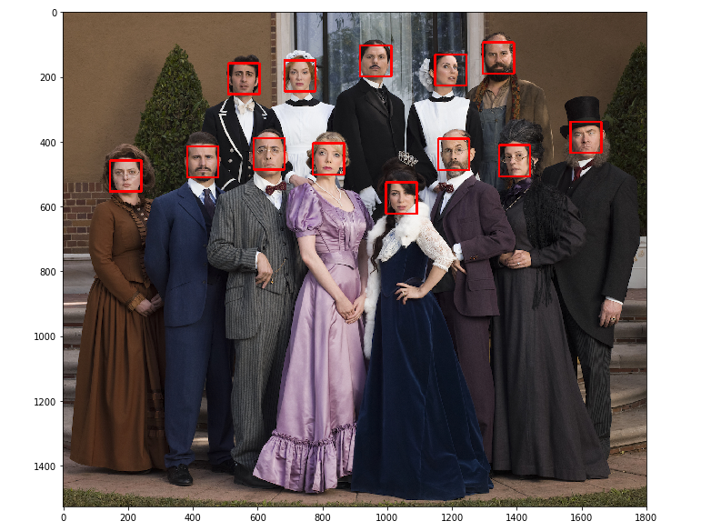

# face_detect
This Repository contains Face Detection Using Haar Cascade Classifier OpenCV Project

### Face detection is a Haar cascade classifier, these classifiers in the OpenCV library and use feature-based classification cascades that learn to isolate and detect faces in an image.

#### The input image looks like:-

#### And after applying Haar Cascade Classifier we can see the face detection like below:-

#### It detect all the 13 faces in the given original image
